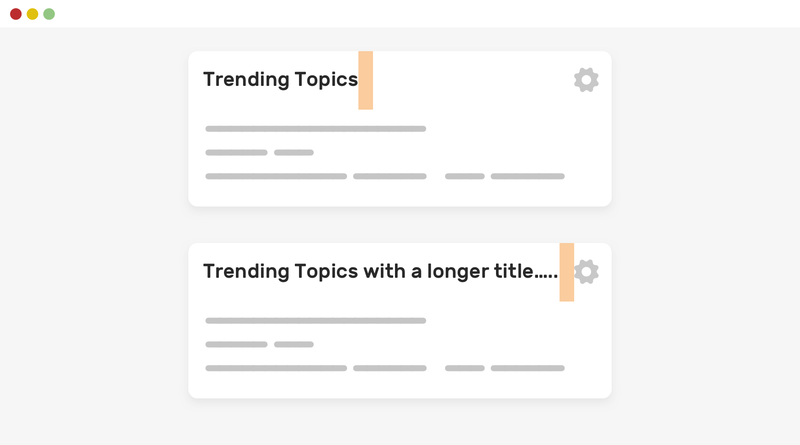
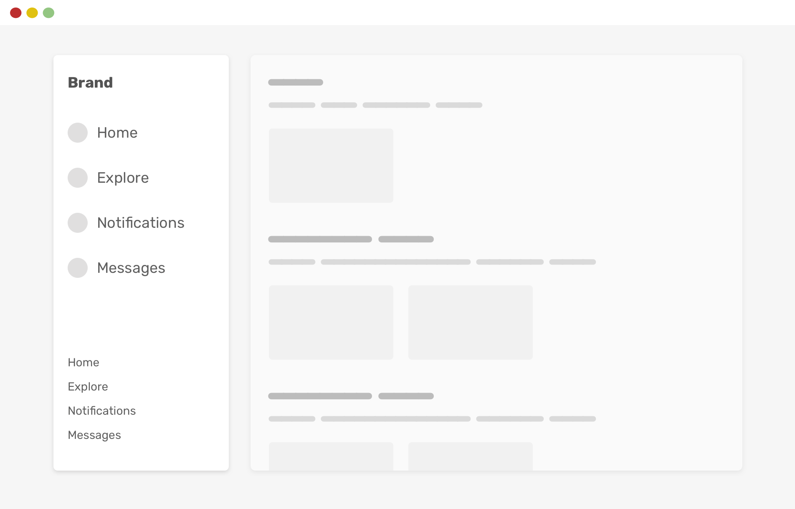
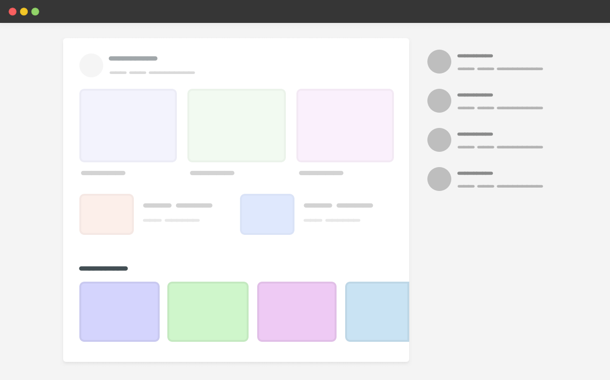

Thông thường, chúng ta ước rằng có một cách để tránh xảy ra một số vấn đề hoặc hành vi CSS nhất định. Bạn biết đấy, nội dung của trang web là động và mọi thứ có thể thay đổi, do đó làm tăng khả năng xảy ra sự cố CSS hoặc một hành vi kỳ lạ.

Defensive CSS là một tập hợp các snippets có thể giúp bạn viết CSS được bảo vệ. Nói cách khác, bạn sẽ gặp ít vấn đề hơn trong tương lai. Nếu bạn theo dõi blog của tôi, bạn có thể đọc một bài viết trước đây của tôi có tên là “Tư duy đề phòng”. Bài viết này được xây dựng dựa trên nó và sẽ là một danh sách liên tục của các đoạn snippets.

<!--truncate-->

## 1. Flexbox Wrapping

CSS flexbox là một trong những tính năng CSS Layout hữu ích nhất hiện nay. Thật hấp dẫn để thêm `display: flex` vào một wrapper và đặt các phần tử con cạnh nhau.

Vấn đề là khi không có đủ không gian hiển thị, theo mặc định, những item con đó sẽ không xếp thành một dòng mới. Chúng ta cần thay đổi hành vi đó bằng `flex-wrap: wrap`.

Đây là một ví dụ điển hình. Chúng ta có một nhóm các tùy chọn sẽ được hiển thị bên cạnh nhau.

```css
.options-list {
  display: flex;
}
```


Khi có ít không gian hơn, các item sẽ bị tràn ra ngoài flex box. Điều đó nên được mong đợi và thực sự không phải là một "vấn đề".


Để ý xem các mục vẫn ở cạnh nhau. Để khắc phục điều đó, chúng ta cần cho phép flex wrapping.

```css
.options-list {
  display: flex;
  flex-wrap: wrap;
}
```


Một nguyên tắc chung khi sử dụng flexbox là cho phép wrapping trừ khi bạn muốn có một scrolling wrapper. Đó là một điều khác, nhưng hãy cố gắng sử dụng `flex-wrap` để tránh các hành vi bố cục không mong muốn (trong trường hợp của chúng tôi là cuộn ngang).

## 2. Spacing

Các developer cần tính đến các độ dài nội dung khác nhau. Điều đó có nghĩa là, khoảng cách nên được thêm vào một component, mặc dù nó có vẻ như không cần thiết.


Trong ví dụ này, chúng ta có tiêu đề phần và action button ở phía bên phải. Hiện tại, nó có vẻ ổn. Nhưng hãy xem điều gì sẽ xảy ra khi tiêu đề dài hơn.


Chú ý làm thế nào văn bản quá gần với action button? Bạn có thể đang nghĩ về multi-line wrapping, nhưng tôi sẽ nói đến điều đó trong một phần khác. Bây giờ, hãy tập trung vào khoảng cách.

Nếu tiêu đề có khoảng cách và cắt bớt văn bản, chúng ta sẽ không gặp vấn đề như vậy.

```css
.section__title {
  margin-right: 1rem;
}
```



## 3. Nội dung dài

Việc tính toán nội dung dài là điều quan trọng khi xây dựng layout. Như bạn có thể thấy ở phần trước, phần tiêu đề bị cắt bớt khi quá dài. Đó là tùy chọn, nhưng đối với một số UI, điều quan trọng là phải tính đến điều đó.

Đối với tôi, đây là một cách tiếp defensive CSS. Thật tuyệt khi khắc phục “sự cố” trước khi nó thực sự xảy ra.

Đây là danh sách tên của user và hiện tại trông nó có vẻ hoàn hảo.


Tuy nhiên, vì đây là nội dung do người dùng tạo, chúng ta cần phải cẩn thận về cách bảo vệ bố cục trong trường hợp nội dung quá dài.

Xem hình sau:


Trong các bố cục như vậy, tính nhất quán rất quan trọng. Để đạt được điều đó, chúng ta có thể cắt bớt tên bằng cách sử dụng `text-overflow`.

```css
.username {
  white-space: nowrap;
  overflow: hidden;
  text-overflow: ellipsis;
}
```


Nếu bạn muốn trau dồi kỹ năng xử lý nội dung dài trong CSS, tôi đã viết một bài viết chi tiết về chủ đề đó.

## 4. Ngăn hình ảnh bị kéo căng hoặc nén

Khi chúng ta không kiểm soát được tỷ lệ khung hình của hình ảnh trên trang web, tốt hơn hết bạn nên suy nghĩ trước và đưa ra giải pháp khi người dùng tải lên một hình ảnh không phù hợp với tỷ lệ khung hình.

Trong ví dụ sau, chúng tôi có một card component với một bức ảnh. Trông nó có vẻ ổn.


Tuy nhiên, khi người dùng tải lên một hình ảnh có kích thước khác, nó sẽ bị kéo giãn. Điều này không tốt. Hãy nhìn hình ảnh được kéo dài như thế nào!


Cách khắc phục đơn giản nhất cho điều đó là sử dụng CSS `object-fit`.

```css
.card__thumb {
  object-fit: cover;
}
```


Ở cấp độ dự án, tôi muốn thêm `object-fit` vào tất cả các hình ảnh để tránh việc hiển thị hình ảnh không mong muốn.

Tìm hiểu thêm về `object-fit` trong bài viết này trên Smashing Magazine.

## 5. Khóa Scroll Chaining

Bạn đã bao giờ mở một modal và bắt đầu cuộn trang, sau đó khi bạn cuộn đến cuối và tiếp tục cuộn, nội dung bên dưới modal thức (phần tử body) sẽ cuộn? Đây được gọi là scroll chaining.

Đã có một vài trick để làm cho nó hoạt động trong những năm qua, nhưng bây giờ, chúng ta có thể làm điều đó chỉ với CSS, nhờ thuộc tính CSS `‌overscroll-behavior`.

Trong hình sau, bạn thấy hành vi scroll chaining mặc định.


Để tránh điều đó trước thời hạn, chúng ta có thể thêm nó vào bất kỳ component nào cần cuộn (ví dụ: chat component, mobile menu...). Điều thú vị về thuộc tính này là nó sẽ không có hiệu lực cho đến khi có thao tác cuộn.

```css
.modal__content {
  overscroll-behavior-y: contain;
  overflow-y: auto;
}
```


Trong trường hợp bạn muốn tìm hiểu thêm về nó, tôi đã viết một bài chi tiết về điều đó.

## 6. CSS Variable Fallback

Các biến CSS ngày càng được sử dụng nhiều hơn trong thiết kế web. Có một phương thức mà chúng ta có thể áp dụng để sử dụng chúng theo cách không phá vỡ trải nghiệm, trong trường hợp giá trị biến CSS trống vì lý do nào đó.

Điều này đặc biệt hữu ích khi cung cấp giá trị của một biến CSS thông qua Javascript. Đây là một ví dụ:

```css
.message__bubble {
  max-width: calc(100% - var(--actions-width));
}
```

Biến `--actions-width` đang được sử dụng trong hàm `calc()` và giá trị của nó đến từ Javascript. Giả sử Javascript không thành công vì một lý do nào đó, điều gì sẽ xảy ra? `max-width` sẽ không tính đến.

Chúng ta có thể tránh điều đó trước thời hạn và thêm giá trị dự phòng vào `var()`.

```css
.message__bubble {
  max-width: calc(100% - var(--actions-width, 70px));
}
```

Bằng cách đó, nếu biến không được xác định, thì dự phòng `(70px)` sẽ được sử dụng. Cách tiếp cận này có thể được sử dụng trong trường hợp có khả năng biến có thể bị lỗi (ví dụ: đến từ Javascript). Nếu không, nó không cần thiết.

## 7. Cố định chiều rộng hoặc chiều cao

### 7.1. Fixed Height

Tôi thường thấy 1 section có chiều cao cố định và nội dung lớn hơn chiều cao đó, dẫn đến bố cục bị hỏng. Không chắc nó trông như thế nào? Nó đây.

```css
.hero {
  height: 350px;
}
```


Để tránh nội dung bị tràn ra khỏi `hero`, chúng ta cần sử dụng `min-height` thay vì `height`.

```css
.hero {
  min-height: 350px;
}
```


Bằng cách đó, nếu nội dung lớn hơn, layout sẽ không bị vỡ.

### 7.2. Fixed Width

Bạn đã bao giờ thấy button có label quá gần các cạnh trái và phải chưa? Điều này xảy ra là do bạn sử dụng chiều rộng cố định, như thế này:

```css
.button {
  width: 100px;
}
```

Nếu label của button dài hơn `100px`, nó sẽ gần với các cạnh. Nếu quá dài, phần text sẽ bị lọt ra ngoài button, điều này thực sự không tốt!

Để khắc phục điều đó, chúng ta chỉ cần thay thế `width` bằng `min-width`.


```css
.button {
  min-width: 100px;
}
```

## 8. Forgetting Background-Repeat

Thông thường, khi sử dụng hình ảnh lớn làm background, chúng ta có xu hướng quên tính đến trường hợp thiết kế được xem trên màn hình lớn. Background đó sẽ lặp lại theo mặc định.

Điều này gần như sẽ không hiển thị trên màn hình laptop, nhưng nó có thể được nhìn thấy rõ ràng trên màn hình lớn hơn.


Để tránh hành vi đó trước, hãy đảm bảo đặt lại `background-repeat`.

```css
.hero {
  background-image: url("..");
  background-repeat: no-repeat;
}
```

## 9. Vertical Media Queries

Đôi khi, thật hấp dẫn khi xây dựng một component và chỉ kiểm tra bằng cách thay đổi kích thước chiều rộng của trình duyệt. Thử nghiệm so với chiều cao của trình duyệt có thể cho thấy một số vấn đề thú vị.

Đây là một cái mà tôi đã thấy nhiều lần. Chúng ta có một component riêng với các liên kết chính và phụ. Các liên kết phụ nên được đặt ở dưới cùng.

Hãy xem xét ví dụ sau. Điều hướng chính và phụ có vẻ ổn. Trong ví dụ mà tôi đã thấy, developer đã thêm `position: sticky` vào điều hướng phụ để nó có thể dính vào phía dưới.



Tuy nhiên, nếu chiều cao trình duyệt nhỏ hơn, layout sẽ bị vỡ. 2 phần điều hướng bị chồng lên nhau.


Bằng cách sử dụng CSS vertical media queries, chúng ta có thể tránh được vấn đề đó.

```css
@media (min-height: 600px) {
  .aside__secondary {
    position: sticky;
    bottom: 0;
  }
}
```

Bằng cách trên, điều hướng phụ sẽ chỉ được dán ở dưới cùng nếu **chiều cao của khung nhìn lớn hơn hoặc bằng 600px**. Tốt hơn nhiều, phải không?

Có lẽ có nhiều cách tốt hơn để triển khai hành vi đó (như sử dụng `margin-auto`) nhưng tôi đang tập trung vào truy vấn dọc cho ví dụ này.

Nếu tôi muốn giải thích bằng cách sử dụng CSS vertical media query, tôi cần phải viết một bài báo viết đủ về nó. Tin tốt là tôi đã viết một bài, trong trường hợp bạn quan tâm.

## 10. Sử dụng Justify-Content: Space-Between

Trong một flex container, bạn có thể sử dụng `justify-content` để tạo khoảng cách giữa các item con với nhau. Với một số lượng item nhất định, bố cục sẽ ổn. Tuy nhiên, khi chúng tăng lên hoặc giảm đi, layout sẽ có vấn đề.

Hãy xem xét ví dụ sau.


Chúng ta có một flex container với 4 item. Khoảng cách giữa mỗi item không phải là `gap` hoặc `margin`, nó ở đó bởi vì container có `justify-content: space-between`.

```css
.wrapper {
  display: flex;
  flex-wrap: wrap;
  justify-content: space-between;
}
```

Khi số lượng item ít hơn 4, đây là điều sẽ xảy ra.


Điều này không tốt. Có các giải pháp khác nhau cho vấn đề này:

- Margin
- Flexbox gap (Sử dụng thận trọng)
- Padding (Có thể được áp dụng cho phần tử cha của mỗi phần tử con)
- Thêm các phần tử trống để hoạt động như một bộ đệm.

Để đơn giản, tôi sẽ sử dụng khoảng `gap`.

```css
.wrapper {
  display: flex;
  flex-wrap: wrap;
  gap: 1rem;
}
```


## 11. Văn bản trên hình ảnh

Khi sử dụng văn bản trên hình ảnh, điều quan trọng là phải tính đến trường hợp hình ảnh không tải được. Khi đó, văn bản sẽ hiển thị như thế nào?

Đây là một ví dụ.


Văn bản trông có thể đọc được, nhưng khi hình ảnh không tải được thì sẽ không.


Chúng tôi khắc phục điều đó một cách dễ dàng bằng cách thêm background vào phần tử &lt;img>. Nền này sẽ chỉ hiển thị nếu hình ảnh không tải được. Điều đó không thú vị phải không?

```css
.card__img {
  background-color: grey;
}
```


## 12. Hãy cẩn thận với các giá trị cố định trong CSS Grid

Giả sử chúng ta có một grid chứa một bên và chính. CSS trông như thế này:

```css
.wrapper {
  display: grid;
  grid-template-columns: 250px 1fr;
  gap: 1rem;
}
```

Điều này sẽ phá vỡ đối với kích thước cửa sổ xem nhỏ do thiếu không gian. Để tránh sự cố như vậy, hãy luôn sử dụng media query khi sử dụng Grid CSS như trên.

```css
@media (min-width: 600px) {
  .wrapper {
    display: grid;
    grid-template-columns: 250px 1fr;
    gap: 1rem;
  }
}
```

## 13. Chỉ hiển thị scrollbar khi cần thiết

May mắn thay, chúng ta có thể kiểm soát để chỉ hiển thị scrollbar trong trường hợp nội dung dài. Tôi khuyên bạn nên sử dụng `auto` làm giá trị cho `overflow`.

Hãy xem ví dụ sau.


Ngay cả khi nội dung ngắn, vẫn có một scrollbar hiển thị. Điều này không tốt cho UI. Là một nhà thiết kế, thật khó hiểu khi thấy scrollbar khi không cần thiết.

```css
.element {
  overflow-y: auto;
}
```

Với `overflow-y: auto`, scrollbar sẽ chỉ hiển thị nếu nội dung dài. Nếu không, nó sẽ không hiển thị. Đây là một con số được cập nhật.


## 14. Scrollbar Gutter

Một thứ khác có liên quan đến scrolling là scrollbar gutter. Lấy ví dụ trước, khi nội dung dài hơn, việc thêm scrollbar sẽ gây ra sự thay đổi bố cục. Lý do thay đổi bố cục xảy ra là để dành một khoảng trống cho scrollbar.

Hãy xem hình sau.


Lưu ý cách nội dung thay đổi khi nó dài hơn do hiển thị scrollbar. Chúng ta có thể tránh hành vi đó bằng cách sử dụng thuộc tính `scrollbar-gutter`.

```css
.element {
  scrollbar-gutter: stable;
}
```


## 15. Kích thước nội dung tối thiểu trong CSS Flexbox

Nếu một flex item có thành phần văn bản hoặc hình ảnh lớn hơn dài hơn kích thước chính item đó, thì trình duyệt sẽ không thu nhỏ chúng. Đó là hành vi mặc định cho flexbox.

Hãy xem ví dụ sau.

```css
.card {
  display: flex;
}
```

Khi tiêu đề có một từ quá dài, tiêu đề đó sẽ không thành một dòng mới.


Ngay cả khi chúng ta sử dụng `overflow-break: break-word`, nó sẽ không hoạt động.

```css
.card__title {
  overflow-wrap: break-word;
}
```

Để thay đổi hành vi mặc định đó, chúng ta cần đặt `min-width` của flex item thành `0`. Đó là vì giá trị mặc định của `min-width` là `auto`, nên hiện tượng tràn sẽ xảy ra.

```css
.card__title {
  overflow-wrap: break-word;
  min-width: 0;
}
```

Điều tương tự cũng áp dụng cho column flex wrapper, nhưng chúng ta sẽ sử dụng `min-height: 0` để thay thế.


## 16. Kích thước nội dung tối thiểu trong CSS Grid

Tương tự như flexbox, Grid CSS có kích thước nội dung tối thiểu mặc định cho các item con của nó là `auto`, đồng nghĩa với việc nếu có một phần tử lớn hơn grid item, nó sẽ tràn.


Trong ví dụ trên, chúng ta có một carousel trong phần chính. Đối với ngữ cảnh, đây là HTML và CSS.

```html
<div class="wrapper">
  <main>
    <section class="carousel"></section>
  </main>
  <aside></aside>
</div>
```

```css
@media (min-width: 1020px) {
  .wrapper {
    display: grid;
    grid-template-columns: 1fr 248px;
    grid-gap: 40px;
  }
}

.carousel {
  display: flex;
  overflow-x: auto;
}
```

Vì carousel là một no-wrap flex container nên chiều rộng của nó lớn hơn main section và do đó grid item tôn trọng điều đó. Kết quả là, có cuộn ngang.

Để khắc phục điều đó, chúng tôi có ba giải pháp khác nhau:

- Sử dụng `minmax()`
- Áp dụng `min-width` cho grid item
- Thêm `overflow: hidden` vào grid item

Là một cơ chế CSS phòng thủ, tôi sẽ sử dụng cơ chế đầu tiên sử dụng hàm `minmax()`.

```css
@media (min-width: 1020px) {
  .wrapper {
    display: grid;
    grid-template-columns: minmax(0, 1fr) 248px;
    grid-gap: 40px;
  }
}
```



Tôi đã viết về điều đó vào đầu năm nay. Tôi cũng thực sự khuyên bạn nên kiểm tra “Preventing a Grid Blowout” và “You want minmax(10px, 1fr) not 1fr” của Chris Coyier.

## 17. Auto Fit và Auto Fill

Khi sử dụng hàm `minmax()` với Grid CSS, điều quan trọng là phải quyết định sử dụng `auto-fit` hay là `auto-fill`. Khi sử dụng không đúng cách có thể dẫn đến những kết quả không như mong muốn.

Khi sử dụng hàm `minmax()`, từ khóa `auto-fit` sẽ mở rộng các grid item để lấp đầy khoảng trống có sẵn. Trong khi `auto-fill` sẽ giữ nguyên không gian có sẵn mà không làm thay đổi chiều rộng các grid item.


Điều đó đang được nói, sử dụng `auto-fit` có thể dẫn đến các grid item quá rộng, đặc biệt là khi chúng ít hơn mong đợi. Hãy xem xét ví dụ sau.

```css
.wrapper {
  display: grid;
  grid-template-columns: repeat(auto-fit, minmax(250px, 1fr));
  grid-gap: 1rem;
}
```

Nếu chỉ có một grid item và sử dụng `auto-fit`, item này sẽ mở rộng để lấp đầy chiều rộng container.


Hầu hết, hành vi như vậy là không cần thiết, vì vậy, theo quan điểm của tôi, sử dụng `auto-fill` sẽ tốt hơn.

```css
.wrapper {
  display: grid;
  grid-template-columns: repeat(auto-fill, minmax(250px, 1fr));
  grid-gap: 1rem;
}
```


## 18. Chiều rộng tối đa của hình ảnh

Theo nguyên tắc chung, đừng quên đặt `max-width: 100%` cho tất cả các hình ảnh. Nó có thể được thêm vào CSS reset mà bạn sử dụng.

```css
img {
  max-width: 100%;
  object-fit: cover;
}
```

## 19. Position: Sticky Css Grid

Bạn đã bao giờ thử sử dụng `position: sticky` với một grid item của 1 grid container chưa? Hành vi mặc định cho các grid item là stretch. Do đó, phần tử aside trong ví dụ dưới đây bằng với chiều cao của main section.


Để làm cho nó hoạt động như mong đợi, bạn cần đặt lại thuộc tính `align-self`.

```css
aside {
  align-self: start;
  position: sticky;
  top: 1rem;
}
```


Tôi đã viết chi tiết về chủ đề đó trên blog của mình, nếu bạn quan tâm.

## 20. Grouping Selectors

Bạn không nên group selectors hoạt động với các trình duyệt khác nhau. Ví dụ: tạo kiểu cho input placeholder cần nhiều selector cho mỗi trình duyệt. Nếu chúng ta group các selectors, toàn bộ quy tắc sẽ không hợp lệ, theo w3c.

```css
/* Don't do this, please */
input::-webkit-input-placeholder,
input:-moz-placeholder {
  color: #222;
}
```

Thay vào đó, hãy làm như sau.

```css
input::-webkit-input-placeholder {
  color: #222;
}

input:-moz-placeholder {
  color: #222;
}
```

## 21. Tổng kết

Đó chưa phải là kết thúc, nhưng tôi thực sự thích ghi lại tất cả các kỹ thuật này. Đây là danh sách liên tục các kỹ thuật CSS phòng thủ mà cá nhân tôi sử dụng tùy thuộc vào dự án mà tôi đang thực hiện.

Tài liệu tham khảo:
<https://ishadeed.com/article/defensive-css/>
