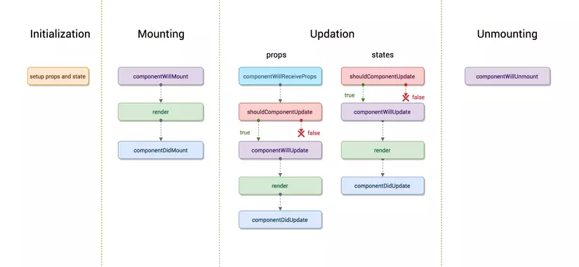

### Table of Contents

| No. | Questions                        |
| --- | -------------------------------- |
|     | **Core React**                   |
| 1   | [React là gì ?](#1-react-là-gì-) |

## Core React

### 1. DOM ảo là gì?

DOM ảo (virtual DOM) là một đại diện được nằm trong bộ nhớ cho một thành phần HTML thật mà cấu thành nên giao diện cho chương trình. Khi một component được thông dịch lại (re-render), DOM ảo sẽ so sánh sự thay đổi với mô hình của DOM thật để tạo một danh sách cập nhật sẽ được thực hiện. Lợi ích chính của việc này là giúp tăng hiệu năng, chỉ tập trung vào các thay đổi nhỏ và thực sự cần thiết với DOM thật hơn là phải re-render lại một tập component lớn.

### 2. Phân biệt Dom thật (Real DOM) và DOM ảo (virtual DOM)

| Real DOM                          | Virtual DOM                     |
| --------------------------------- | ------------------------------- |
| Update chậm                       | Update nhanh                    |
| Có thể update trực tiếp HTML      | Không thể update trực tiếp HTML |
| Tạo ra DOM mới nếu element update | Update JSX nếu element update   |
| Thao tác DOM phức tạp tốn kém     | Thao tác DOM đơn giản           |
| Lãng phí nhiều bộ nhớ             | Không lãng phí bộ nhớ           |

### 3. JSX là gì ?

_JSX_ là một **phần mở rộng cú pháp** cho JavaScript (từ viết tắt của _JavaScript XML_). Về cơ bản, nó chỉ cung cấp đường cú pháp cho hàm `React.createElement()`, chúng ta có thể viết các cấu trúc HTML trong cùng một tệp chứa code JavaScript.

Ta có:

```js
<div className="sidebar" />
```

Khi được dịch sang Javascript sẽ là:

```js
React.createElement("div", { className: "sidebar" });
```

### 4.Các tính năng chính của ReactJS là gì?

Các tính năng chính của React là:

- Nó sử dụng **VirtualDOM** thay vì RealDOM vì các thao tác trên RealDOM rất tốn kém.
- Hỗ trợ **server-side rendering**.
- Tuân theo luồng dữ liệu một chiều (unidirectional data flow) hoặc ràng buộc dữ liệu (data binding). Luồng dữ liệu một chiều có nghĩa là khi thiết kế một ứng dụng React, bạn thường lồng các components con bên trong các components mẹ.
- Sử dụng các thành phần giao diện người dùng có thể **tái sử dụng (reusable)** hoặc kết hợp để phát triển giao diện người dùng.

Nó sử dụng VirtualDOM thay vì RealDOM vì các thao tác trên RealDOM rất tốn kém.
Hỗ trợ kết xuất phía máy chủ.
Tuân theo luồng dữ liệu một chiều hoặc ràng buộc dữ liệu.
Sử dụng các thành phần giao diện người dùng có thể tái sử dụng / có thể kết hợp để phát triển chế độ xem.

### 5. Ưu điểm của ReactJS là gì?

Dưới đây là những ưu điểm của ReactJS:

- Tăng hiệu suất của ứng dụng với Virtual DOM.
- JSX làm cho mã dễ đọc và viết.
- Nó kết xuất cả phía máy khách và máy chủ.
- Dễ dàng tích hợp với các frameworks khác (Angular, BackboneJS) vì nó chỉ là một thư viện giao diện.
- Dễ dàng viết các trường hợp kiểm thử UI và tích hợp với các công cụ như JEST.

### 6. Dưới đây là những ưu điểm của ReactJS:

Tăng hiệu suất của ứng dụng với Virtual DOM.
JSX làm cho mã dễ đọc và viết.
Nó kết xuất cả phía máy khách và máy chủ.
Dễ dàng tích hợp với các frameworks khác (Angular, BackboneJS) vì nó chỉ là một thư viện giao diện.
Dễ dàng viết các trường hợp kiểm thử UI và tích hợp với các công cụ như JEST.

### 7. Sự khác nhau giữa class component và functional component?

**Class component:**

Trước phiên bản React 16.8 (trước khi giới thiệu hooks), component dựa theo class thường được sử dụng để tạo component, với mục đích để lưu giữ trạng thái bên trong hay tận dụng các phương thức vòng đời (Ví dụ: `componentDidMount` hay `shouldComponentUpdate` ). Một component dựa theo class là một class ES6, nó mở rộng class React Component và với tối thiểu phải thực hiện phương thức `render()`

```js
class Welcome extends React.Component {
  render() {
    return <h1>Hello, {this.props.name}</h1>;
  }
}
```

Vì vậy, một React class component là:

- Là một class ES6, nó sẽ là một component khi nó "kế thừa" React component.
- Có thể nhận props (trong hàm khởi tạo) nếu cần.
- Có thể maintain data của nó với state
- Phải có 1 method render() trả về 1 React element (JSX), or null

**Functional component:**

Functional component là không có trạng thái (stateless) (được dùng ở phiên bản React sau 16.8) và trả về output mà cần được render. Chúng phù hợp với việc render UI chỉ phụ thuộc vào props, thông thường chúng đơn giản hơn và nhanh hơn so với component dựa theo class.

```js
function Welcome(props) {
  return <h1>Hello, {props.name}</h1>;
}
```

Vậy 1 React Functional Component (Stateless component) là:

- Một function Javascript / ES6 function
- Phải trả về 1 React element
- Nhận props làm tham số nếu cần

### 8. Sự khác nhau giữa state và props?

Props là dữ liệu được truyền vào trong một component từ cha của nó. Chúng không nên bị thay đổi, và chỉ dùng để hiển thị hay tính toán các giá trị khác. State là dữ liệu bên trong của một component, nó có thể được thay đổi trong vòng đời của component và được duy trì giữa các lần re-render

### 9. Keys trong ReactJs được dùng để làm gì?

Khi thực hiên render một tập hợp trong React, việc thêm một key cho mỗi thành phần được lặp lại là cần thiết để giúp React theo dấu mối liên kết giữa các thành phần và dữ liệu. Key nên là một ID duy nhất, lý tưởng nhất nên là một UUID hay một chuỗi duy nhất khác từ tập hợp phần tử, hoặc cũng có thể là index của array.

```js
<ul>
  {todos.map((todo) => (
    <li key={todo.id}>{todo.text}</li>
  ))}
  ;
</ul>
```

### 10. Tại sao phải gọi `setState` thay vì trực tiếp thay đổi state?

Nếu bạn cố gắng thay đổi một state của component trực tiếp, React sẽ không thể biết được khi nào nó cần phải re-render component. Bằng cách sử dụng phương thức `setState()`, React có thể cập nhật component của UI.

Nếu bạn cần cập nhật một state của component dựa theo dữ liệu của state khác hay props khác, chỉ cần truyền một hàm vào `setState()`, khi đấy bạn truyền state và props như 2 tham số của hàm

### 11. Ngữ cảnh (context) trong React.js là gì?

Context cung cấp một cách thức để truyền dữ liệu qua cây thành phần (component tree) mà không phải chuyển các Props xuống theo cách thủ công ở mọi cấp độ. Ví dụ thông tin user đã đăng nhập, tùy chọn ngôn ngữ, UI Theme cần được truy cập trong ứng dụng bởi nhiều component.

```js
const { Provider, Consumer } = React.createContext(defaultValue);
```

### 11. Cú pháp của React ES6 khác thế nào khi so với ES5 như thế nào?

Require và Import:

```js
// ES5
var React = require("react");

// ES6
import React from "react";
```

Export và Exports

```js
// ES5
module.exports = Component;

// ES6
export default Component;
```

Component và Function

```js
// ES5
var MyComponent = React.createClass({
  render: function () {
    return <h2>Hello Edureka!</h2>;
  },
});

// ES6
class MyComponent extends React.Component {
  render() {
    return <h2>Hello Edureka!</h2>;
  }
}
```

Props

```js
// ES5
var App = React.createClass({
  propTypes: { name: React.PropTypes.string },
  render: function () {
    return <h2>Hello, {this.props.name}!</h2>;
  },
});

// ES6
class App extends React.Component {
  render() {
    return <h2>Hello, {this.props.name}!</h2>;
  }
}
```

Class

```js
// ES5
var App = React.createClass({
  getInitialState: function () {
    return { name: "world" };
  },
  render: function () {
    return <h2>Hello, {this.state.name}!</h2>;
  },
});

// ES6
class App extends React.Component {
  constructor() {
    super();
    this.state = { name: "world" };
  }
  render() {
    return <h2>Hello, {this.state.name}!</h2>;
  }
}
```

### 12. React hook là gì?

Hook là nỗ lực của React để mang sự thuận tiện của component dựa theo class sang component dựa theo function (bao gồm state nội tại và các phương thức vòng đời)

- Hooks là một bổ sung mới trong React 16.8.
- Hooks là những hàm cho phép bạn "kết nối" React state và lifecycle vào các components sử dụng hàm.
- Với Hooks bạn có thể sử dụng state và lifecycles mà không cần dùng ES6 Class.

### 13. Các ưu điểm của React hooks?

- Khiến các component trở nên gọn nhẹ hơn
- Giảm đáng kể số lượng code, dễ tiếp cận
- Xoá bỏ sự không cần thiết của component dựa theo class, các vòng đời và keyword this
- Dễ dàng tái sử dụng logic, bằng cách trừu tượng hoá các chức năng phổ biến thành custom hook
- Code dễ đọc, dễ test bằng cách chia sẻ logic giữa các component với nhau

### 14. Redux là gì?

Redux là thư viện quản lý state bên thứ 3 cho React, được tạo trước context API. Nó dựa theo khái niệm của một kho chứa state, hay gọi là `store`, các component có thể nhận dữ liệu từ các props. Cách duy nhất để update store là dispatch một hành động đến store, và việc này được thực thi qua reducer. Reducer sẽ nhận action và state hiện tại, và trả về một state mới, đồng thời kích hoạt cho các component đăng ký trạng thái re-render lại.

### 15. Chức năng của hàm render() trong React là gì?

Mỗi React component bắt buộc phải có hàm `render()`. Hàm `render()` trả về duy nhất React element. Nếu bạn cần trả về nhiều React element thì bạn phải nhóm chúng trong một thẻ khác ví dụ như `<form></form>, <div></div>`,...

Hàm render chính là phần hiển thị giao diện(UI) cho người dùng tại bất cứ thời điểm nào. Nếu dữ liệu thay đổi, React sẽ tự động gọi hàm render để update lại UI thực hiện việc update UI với dữ liệu tương ứng.

### 16. ReactJS là gì? Nêu các tính năng nổi bật của Reactjs?

React là thư viện JavaScript được phát triển bởi Facebook vào năm 2011. Nó được dùng để xây dựng giao diện người dùng (User Interface – UI) dạng Single Page. Một số tính năng nổi bật của Reactjs:

- Sử dụng JSX: Trong React, thay vì thường xuyên sử dụng JavaScript để thiết kế bố cục trang web thì sẽ dùng JSX. JSX được đánh giá là sử dụng đơn giản hơn JavaScript và cho phép trích dẫn HTML cũng như việc sử dụng các cú pháp thẻ HTML để render các subcomponent. JSX tối ưu hóa code khi biên soạn, vì vậy nó chạy nhanh hơn so với code JavaScript tương đương.

- Single-way data flow (Luồng dữ liệu một chiều): ReactJS không có những module chuyên dụng để xử lý data, vì vậy ReactJS chia nhỏ view thành các component nhỏ có mỗi quan hệ chặt chẽ với nhau. Luồng truyền dữ liệu trong ReactJS là luồng dữ liệu một chiều từ cha xuống con. Việc ReactJS sử dụng one-way data flow có thể gây ra một chút khó khăn cho những người muốn tìm hiểu và ứng dụng vào trong các dự án. Tuy nhiên, cơ chế này sẽ phát huy được ưu điểm của mình khi cấu trúc cũng như chức năng của view trở nên phức tạp thì ReactJS sẽ phát huy được vai trò của mình.

- Virtual DOM: Những Framework sử dụng Virtual-DOM như ReactJS khi Virtual-DOM thay đổi, chúng ta không cần thao tác trực tiếp với DOM trên View mà vẫn phản ánh được sự thay đổi đó. Do Virtual-DOM vừa đóng vai trò là Model, vừa đóng vai trò là View nên mọi sự thay đổi trên Model đã kéo theo sự thay đổi trên View và ngược lại. Có nghĩa là mặc dù chúng ta không tác động trực tiếp vào các phần tử DOM ở View nhưng vẫn thực hiện được cơ chế Data-binding. Điều này làm cho tốc độ ứng dụng tăng lên đáng kể – môt lợi thế không thể tuyệt vời hơn khi sử dụng Virtula-DOM.

### 17. JSX là gì? Các trình duyệt có đọc được JSX không?

JSX (JavaScript XML) là một loại cú pháp mở rộng dành cho ngôn ngữ JavaScript viết theo kiểu XML.

Mã lệnh viết bằng JSX sẽ được chuyển sang JavaScript để trình duyệt có thể hiểu được.

Ví dụ:

```js
const element = <h1>Hello, world!</h1>;
const name = "Mark";
const element = <h1>Hello, {name}</h1>;
```

Các trình duyệt không thể đọc được các thẻ JSX bởi vì JSX không phải một đối tượng Javascript thông thường. Về cơ bản, nó là một phương ngữ mới phổ biến mà chỉ đơn giản tích hợp các mẫu HTML vào mã JavaScript. Để đọc được cần có sự hỗ trợ của WebPack hoặc Babel.

### 18. Sự khác nhau của các từ khóa let, var, const trong ES6?

`let` tạo ra một biến chỉ có thể truy cập được trong block bao quanh nó, khác với `var` - tạo ra một biến có phạm vi truy cập xuyên suốt function chứa nó.

`const` dùng để khai báo một hằng số - là một giá trị không thay đổi được trong suốt quá trình chạy.

Lưu ý trường hợp này với `let` và `const` trong ES6:

```js
function foo () {
  typeof bar;
  let bar = ‘baz’;
}
foo(); // ReferenceError: can't access lexical declaration
       // `bar' before initialization

```

### 19. Bạn thích Hooks nào? Hãy tạo một Hooks bất kỳ.

Người phỏng vấn muốn thấy: bạn sử dụng Hooks và hiểu cách nó hoạt động như thế nào. Mặc dù Hooks mới được giới thiệu từ React 16.8, nhưng đã có nhiều người sử dụng nó trong sản phẩm của họ và họ mong đợi bạn biết nó.

Chúng ta hãy tạo 1 hook “useWindowSize” – đây là một hook khá đơn giản và dễ hiểu.

```js
import { useState, useEffect } from "react";
const useWindowSize = () => {
  const getSize = () => ({
    width: window.innerWidth,
    height: window.innerHeight,
  });
  const [size, setSize] = useState(getSize);
  useEffect(() => {
    const handleResize = () => setSize(getSize());
    window.addEventListener("resize", handleResize);
    return () => window.removeEventListener("resize", handleResize);
  }, []);
  return size;
};
```

Cách dùng:

```js
const App = () => {
  const size = useWindowSize();
  return (
    <div>
      {size.width}px / {size.height}px
    </div>
  );
};
```

Bạn có thể sẽ nhận được thêm vài câu hỏi như sau:

- Có cần thiết phải đặt tên hook của bạn là “useWindowSize” không, đặt tên khác ví dụ như “getWindowSize” thì sao? Nó là cần thiết, vì theo rules of Hooks, tên hook luôn phải bắt đầu với từ “use”.
- Nó có hoạt động không nếu chúng ta bỏ “[]” khỏi “useEffect”? Nó vẫn hoạt động, nhưng nó sẽ gọi hook “useEffect” mỗi lần render, điều này sẽ làm gây ra các vấn đề về performance.
- Làm sao React biết khi nào sẽ re-render component “App” nếu chúng ta xử lý window resizing trong “useWindowSize”? Khi chúng ta gọi “setSize” bên trong hook “useWindowSize”, React biết hook đó được dùng trong component “App” và sẽ re-render nó.
- Làm sao để hook này không bị lỗi khi dùng ở Server-Side render?

```js
import { useState, useEffect } from "react";
const useWindowSize = () => {
  const isClient = typeof window === "object";
  const getSize = () => ({
    width: isClient ? window.innerWidth : undefined,
    height: isClient ? window.innerHeight : undefined,
  });
  const [size, setSize] = useState(getSize);
  useEffect(() => {
    const handleResize = () => setSize(getSize());
    window.addEventListener("resize", handleResize);
    return () => window.removeEventListener("resize", handleResize);
  }, []);
  return size;
};
```

### 19. React hoạt động như thế nào?

React tạo ra một DOM ảo.

Khi trạng thái thay đổi trong một component, trước tiên nó chạy một thuật toán "khác biệt (diffing)", xác định những gì đã thay đổi trong DOM ảo.

Bước thứ hai là điều chỉnh (reconciliation), nơi nó cập nhật DOM với kết quả của khác biệt.

### 20. Làm sao để viết 1 inline style trong React?

Ta có thể viết như sau:

```js
div style={{ height: 10 }}>kungfutech.edu.vn</div>
```

### 21. Props trong React là gì?

Props là đầu vào cho một React component.

Chúng là các giá trị đơn lẻ hoặc các đối tượng chứa một tập hợp các giá trị được chuyển cho React component khi khởi tạo bằng cách sử dụng quy ước đặt tên tương tự như các thuộc tính thẻ HTML. Tức là, Props là dữ liệu được truyền từ thành phần mẹ sang thành phần con.

### 22. Refs được dùng như thế nào?

Refs thường được dùng để trả về một tham chiếu tới 1 phần tử.

Hầu hết nên tránh sử dụng chúng trong các trường hợp, tuy nhiên chúng có thể hữu ích khi chúng ta cần truy cập trực tiếp vào phần tử DOM hoặc 1 component trong React.

Refs cho phép bạn truy cập trực tiếp vào phần tử DOM hoặc một phiên bản của thành phần.

Để sử dụng chúng, bạn thêm thuộc tính ref vào component có giá trị là một hàm callback sẽ nhận phần tử DOM bên dưới hoặc phiên bản được gắn kết của component làm đối số đầu tiên của nó.

```js
class UnControlledForm extends Component {
  handleSubmit = () => {
    console.log("Input Value: ", this.input.value);
  };
  render() {
    return (
      <form onSubmit={this.handleSubmit}>
        <input type="text" ref={(input) => (this.input = input)} />
        <button type="submit">Submit</button>
      </form>
    );
  }
}
```

Ở trên lưu ý rằng trường đầu vào của chúng ta có thuộc tính ref có giá trị là một hàm. Hàm đó nhận phần tử DOM thực tế của đầu vào mà sau đó chúng ta đặt trên component để có quyền truy cập vào nó bên trong hàm handleSubmit.

Người ta thường hiểu sai rằng bạn cần sử dụng một class component để sử dụng refs, nhưng refs cũng có thể được sử dụng với các functional component bằng cách tận dụng các bao đóng (leveraging closures) trong JavaScript.

```js
function CustomForm({ handleSubmit }) {
  let inputElement;
  return (
    <form onSubmit={() => handleSubmit(inputElement.value)}>
      <input type="text" ref={(input) => (inputElement = input)} />
      <button type="submit">Submit</button>
    </form>
  );
}
```

### 23. Props drilling là gì?

Prop drilling (còn được gọi là "threading") là thuật ngữ chỉ tiến trình mà bạn phải đi qua để có thể lấy dữ liệu cho các phần của React component tree. Cùng quan sát một ví dụ đơn giản với `stateful component`

```js
function Toggle() {
  const [on, setOn] = React.useState(false);
  const toggle = () => setOn((o) => !o);
  return (
    <div>
      <div>The button is {on ? "on" : "off"}</div>
      <button onClick={toggle}>Toggle</button>
    </div>
  );
}
```

Chúng ta hãy thử chia nó thành 2 components:

```js
function Toggle() {
  const [on, setOn] = React.useState(false);
  const toggle = () => setOn(o => !o);
  return <Switch on={on} onToggle={toggle} />;
}

function Switch({ on, onToggle }) {
  return (
    <div>
      <div>The button is {on ? "on" : "off"}</div>
      <button onClick={onToggle}>Toggle</button>
    </div>
  );
```

Nói một cách đơn giản `Switch` component cần có tham chiếu tới `toggle` và `on` state, vậy nên chúng ta cần truyền props ở đây. Cùng refactor lại một lần nữa để thêm một layer khác vào component tree của chúng ta.

```js
function Toggle() {
  const [on, setOn] = React.useState(false);
  const toggle = () => setOn((o) => !o);
  return <Switch on={on} onToggle={toggle} />;
}

function Switch({ on, onToggle }) {
  return (
    <div>
      <SwitchMessage on={on} />
      <SwitchButton onToggle={onToggle} />
    </div>
  );
}

function SwitchMessage({ on }) {
  return <div>The button is {on ? "on" : "off"}</div>;
}

function SwitchButton({ onToggle }) {
  return <button onClick={onToggle}>Toggle</button>;
}
```

Đây chính là `prop drilling`. Để lấy được `on` state và `toggle` handler ở đúng chỗ ta cần chuyển (drill - thread) props thông qua `Switch` component. Bản thân `Switch` component không cần những giá trị này cho bản thân nó, nhưng ở đây ta vẫn phải chấp nhận và chuyển tiếp các props này xuống dưới các components con của nó.

### 24. React context là gì?

Context API được cung cấp bởi React để giải quyết vấn đề chia sẻ state giữa các component trong một ứng dụng. Trước khi context (bối cảnh) được giới thiệu, giải pháp duy nhất là sử dụng một thư viện quản lý state, VD như `Redux`. Tuy nhiên, nhiều nhà phát triển cảm thấy `Redux` cung cấp nhiều thứ phức tạp không cần thiết, đặc biệt là với ứng dụng nhỏ.

React Context tồn tại để bạn không cần truyền dữ liệu một cách thủ công bằng việc sử dụng props ở tất cả các cấp của component. Context chia sử dữ liệu cho nhiều các component khác nhau. Việc truyền dữ liệu từ component cha xuống component con thông qua props là tương đối dài dòng và khó kiểm sóat so với việc sử dụng Context API. Bằng việc sử dụng Context API, chúng ta không còn cần phải truyền các dữ liệu muốn chia sẻ với nhau thông qua việc dùng props.

### 25. Trình bày sự khác nhau giữa State và Props?

State là một cấu trúc dữ liệu bắt đầu với một giá trị mặc định khi một component `mount`. Nó có thể bị thay đổi theo thời gian, chủ yếu là do các sự kiện của người dùng.

Props (viết tắt của properties) là một cấu hình của component và chúng được nhận từ phía trên. Component không thể thay đổi các Props của nó, nhưng nó có trách nhiệm tập hợp các Props của các component con lại với nhau. Props không nhất thiết phải là dữ liệu - các hàm `callback` cũng có thể được chuyển vào làm Props.

| Tiêu chí                                   | State | Props |
| ------------------------------------------ | ----- | ----- |
| Nhận giá trị ban đầu từ thành phần gốc     | Có    | Có    |
| Thành phần cha có thể thay đổi giá trị     | Không | Có    |
| Đặt giá trị mặc định bên trong thành phần  | Có    | Có    |
| Thay đổi bên trong thành phần              | Có    | Không |
| Đặt giá trị ban đầu cho các thành phần con | Có    | Có    |
| Thay đổi bên trong các thành phần con      | Không | Có    |

### 26. Hàm setState trong Reactjs là đồng bộ hay bất đồng bộ? Tại sao?

Hàm `setState()` trong Reactjs là bất đồng bộ.
Nguyên nhân là do React cố tình chờ khi tất cả Component gọi tới hàm `setState()` trước khi bắt đầu re-render, điều này làm tăng hiệu suất, tránh việc re-render không cần thiết.

### 27. Life Cycle trong React hoạt động như thế nào ? Hãy chỉ ra flow của một life cycle?



Nhìn vào hình ảnh trên thì có 3 phần chính chúng ta sẽ tìm hiểu đó chính là

- Mounting
- Updation
- Unmounting

**Mounting**

Chắc hẳn các bạn cũng biết khái niệm hook rồi đúng không - tức là cho phép người dùng can thiệp vào quá trình cập nhật UI với những thay đổi của `state` hoặc `props`. Các bạn nhìn cột Mounting có 3 phướng thức lifecycle đó là

`componentWillMount()`
`render()`
`componentDidMount()`

Như các bạn thấy đấy khi chúng ta refresh lại trang web hoặc mới truy cập thì 3 method lifecycle này sẽ lần lượt chạy. Một khi mà component được render trong lần đầu tiên thì phương thức `componentWillMount()` sẽ được gọi trước khi render. Chúng mình có thể hiểu như này, trước khi compont vô DOM bằng hàm render() thì hàm `componentWillMount()` sẽ được gọi. Chú ý chúng ta không nên gọi hàm `setState()` trong hàm `componentWillMount()` vì nó chưa có DOM nào để tương tác.

`componentDidMount()` sẽ được gọi sau khi render component, ở đây cũng là nơi thực hiện các hàm AJAX, axios request, DOM hay update state sẽ được thực thi tại đây. Phương thức này cũng được kết nối với các Framwork khác hay database. Chúng mình sẽ đặt hàm `setState()` ở đây để tương tác vì Component đã được vô DOM.

Ví dụ

```js
import React, { Component } from "react";
import logo from "./logo.svg";
import "./App.css";

class Demo extends Component {
  constructor(props) {
    super(props);
    // Don't do this!
    this.state = { color: "green" };
  }
  componentWillMount() {
    console.log("componentWillMount da chay");
  }

  componentDidMount() {
    console.log("componentDidMount da chay");
  }

  render() {
    console.log("Ham render da duoc chay");
    return (
      <div>
        <button onClick={() => this.setState({ color: "aaaaa" })}>
          Submit
        </button>
        <p>{this.state.color}</p>
      </div>
    );
  }
}
class App extends Component {
  render() {
    return (
      <div className="App">
        <header className="App-header">
          
          <h1 className="App-title">Welcome to React</h1>
        </header>
        <Demo></Demo>
        <p className="App-intro"></p>
      </div>
    );
  }
}

export default App;
```

Vậy chúng mình có thể kết luận được khi mà Component được khởi tạo thì React sẽ follow theo trình tự như sau :

- Khởi tạo class đã kế thừa từ Component
- Khởi tạo giá trị mặc định cho Props
- Khởi tạo giá trị mặc định cho State
- Gọi hàm `componentWillMount()`
- Gọi hàm `render()`
- Gọi hàm `componentDidMount()`

**Updation**

Chúng mình sẽ đi tìm hiểu từng method một nhé

- `componentWillReceiveProps():` Chạy khi component con nhận props từ component cha. Sau khi nhận được props mới từ component cha rồi có thì component con có thể set lại state.
- `shouldComponentUpdate()`: Hàm này có thể nói là nó tăng hiệu năng của React lên. Nếu như return false thì các phương thực `componentWillUpdate`, `render`, `componentDidUpdate` sẽ không được chạy nữa(vì mặc định nó return về true để chạy được 3 hàm tiếp theo, nhiều trường hợp mình không cần chạy 3 hàm tiếp theo).
- `componentWillUpdate()`: Hàm này cũng giống như hàm `componentWillMount()` trước khi re-render ra Component. Nhưng chúng mình hầu hết không tương tác gì nhiều lắm trong hàm này, hàm setState hầu hết chúng mình sẽ sủ dụng trong hàm `componentWillReceiveProps`
- `componentDidUpdate()`: hàm này được gọi đến sau khi đã re-render lại hay React đã cập nhật lại UI, nếu mà chúng ta muốn chạy animation thì đây chính là lúc chúng ta nên gọi trong hàm này.

Mình lấy một ví dụ nhé, ví dụ dưới đây sẽ thêm mới một phần tử vào trong danh sách Note để. Component cha là ListNote, component con là Note. Các bạn chỉ cần focus vào nhứng thứ sau:

Trong component ListForm khi chúng ta ấn Submit để thêm một phần tử vào danh sách thì sau khi cập nhật lại Component thì chúng ta sẽ render 1 Note có truyền những props. Các bạn chú ý trong hàm `getData()`.
Trong component Note có component `componentWillReceiveProps()` để hiện ra thông báo là vừa nhận được props từ cha.

```js
// file listNote.js
import React from "react";
import Note from "./Note.js";
import FormNote from "./FormNote.js";
import { firebaseConnect } from "../firebaseConnect.js";
import { connect } from "react-redux";
import store from "../store.js";

class listNote extends React.Component {
  constructor(props) {
    super(props);
    this.state = {
      data: [],
    };
    this.getData = this.getData.bind(this);
  }

  componentWillMount() {
    let current = this;
    firebaseConnect.on("value", function (notes) {
      const arrData = [];
      notes.forEach((element) => {
        const id = element.key;
        const title = element.val().title;
        const content = element.val().content;
        arrData.push({
          id: id,
          title: title,
          content: content,
        });
      });
      //console.log(arrData);
      current.setState({
        data: arrData,
      });
      //console.log(current.state.data);
    });
  }

  getData() {
    console.log(this.state.data);
    return this.state.data.map(function (value, key) {
      return (
        <Note
          key={key}
          title={value.title}
          content={value.content}
          note={value}
        />
      );
    });
  }

  showForm() {
    if (this.props.isEdit) {
      return <FormNote />;
    }
  }

  showFormAddData() {
    if (this.props.isAdd) {
      return <FormNote />;
    }
  }
  render() {
    return (
      <div className="row">
        <div className="col-8">{this.getData()}</div>
        <div className="col-4">
          {this.showForm()}
          {this.showFormAddData()}
        </div>
      </div>
    );
  }
}

const mapPropsToState = (state, ownProps) => {
  return {
    isEdit: state.isEdit,
    isAdd: state.isAdd,
  };
};

const mapDispatchToState = (dispatch, ownProps) => {
  return {
    changeEditStatus: () => {
      dispatch({ type: "CHANGE_EDIT_STATUS" });
    },
  };
};
export default connect(mapPropsToState, mapDispatchToState)(listNote);
```

```js
// file Note.js
import React from "react";
import { connect } from "react-redux";
import store from "../store.js";

class Note extends React.Component {
  constructor(props) {
    super(props);
  }

  componentWillReceiveProps(nextProps) {
    console.log("Component con da nhan duoc props tu component cha");
  }
  twoAction() {
    this.props.changeEditStatus();
    this.props.changeEditItem(this.props.note);
  }

  deleteDataItem() {
    if (window.confirm("Are you sure delete item") == true) {
      this.props.deleteItemFunc(this.props.note);
    }
  }
  render() {
    return (
      <div className="row">
        <div className="col-8">
          Title: {this.props.title}
          <br />
          Noi dung: {this.props.content}
        </div>
        <div col-4>
          <button onClick={() => this.twoAction()}>Edit</button>
          <button onClick={() => this.deleteDataItem()}>Delete</button>
        </div>
      </div>
    );
  }
}

const mapPropsToState = (state, ownProps) => {
  return {};
};

const mapDispatchToState = (dispatch, ownProps) => {
  return {
    changeEditStatus: () => {
      dispatch({ type: "CHANGE_EDIT_STATUS" });
    },
    changeEditItem: (editItem) => {
      dispatch({ type: "EDIT_ITEM", editItem });
    },
    deleteItemFunc: (deleteItem) => {
      dispatch({ type: "DELETE_ITEM", deleteItem });
    },
  };
};
export default connect(mapPropsToState, mapDispatchToState)(Note);
```
