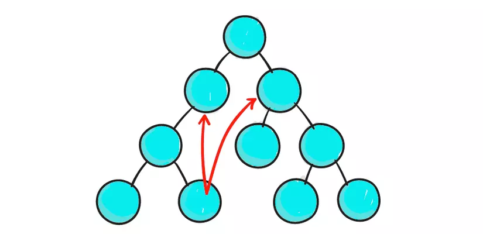
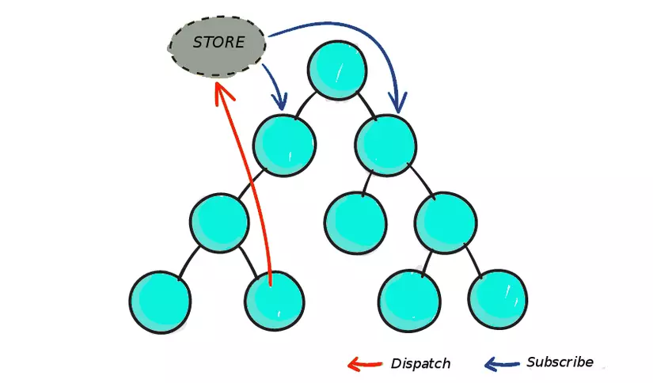
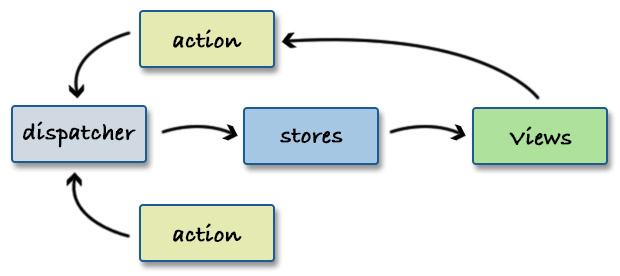

### Table of Contents

| No. | Questions                        |
| --- | -------------------------------- |
|     | **Core React**                   |
| 1   | [React là gì ?](#1-react-là-gì-) |

## Core React

### 1. Làm thế nào để bạn chặn callback của 1 event trong React?

Bạn có thể gọi `e.preventDefault()` với e là tham số được truyền vào callback.

### 2. React khác với AngularJS (1.x) như thế nào?

AngularJS (1.x) tiếp cận việc xây dựng một ứng dụng bằng cách mở rộng HTML markup và đưa vào các cấu trúc khác nhau (ví dụ: Directives, Controllers, Services) trong thời gian chạy (runtime). Do đó, AngularJS rất kiên định về kiến ​​trúc trong ứng dụng của bạn (khó thay đổi kiến trúc) - những điều trừu tượng này chắc chắn hữu ích trong một số trường hợp, nhưng chúng sẽ phải tốn nhiều chi phí hơn.

Ngược lại, React tập trung hoàn toàn vào việc tạo ra các component và có rất ít ý kiến ​​(nếu có) về kiến ​​trúc của ứng dụng. Điều này cho phép nhà phát triển có thể linh hoạt một cách đáng kinh ngạc trong việc lựa chọn kiến ​​trúc mà họ cho là "tốt nhất" - mặc dù nó cũng đặt trách nhiệm chọn (hoặc xây dựng) các phần đó cho nhà phát triển.

### 3. Làm cách nào bạn ngăn một component hiển thị trong React?

Trả về null từ hàm `render()`.

```js
render() {
  return null
}
```

### 4. Mô tả cách xử lý các event trong React?

Để giải quyết các vấn đề về khả năng tương thích giữa các trình duyệt, `Event handler` của bạn trong React sẽ được chuyển qua các `SyntheticEvent`, là trình bao bọc `cross-browser` của React xung quanh sự kiện gốc (native event) của trình duyệt. Các `synthetic event` này có interface giống với các sự kiện gốc mà bạn đã từng sử dụng, ngoại trừ chúng hoạt động giống nhau trên tất cả các trình duyệt.

Có chút thú vị là React không thực sự đính kèm các sự kiện vào chính các nút con. React sẽ lắng nghe tất cả các sự kiện ở cấp cao nhất bằng cách sử dụng một `event listener` duy nhất. Điều này tốt cho hiệu suất và nó cũng có nghĩa là React không cần phải lo lắng về việc theo dõi các event listener khi cập nhật DOM.

### 5. Tại sao nên sử dụng Redux?

Chúng ta có hoàn toàn có thể build một project hoàn chỉnh với chỉ React. Nhưng khi project của bạn ngày càng lớn, với ngày càng nhiều component, việc chỉ sử dụng duy nhất React để quản lý state sẽ trở nên rất phức tạp.



Đây chính là lúc Redux toả sáng; nó làm giảm bớt sự phức tạp trong các ứng dụng lớn như vậy. Nếu bạn đã hiểu qua về React thị bạn sẽ biết rằng luồng dữ liệu của React bắt đầu từ các component cha truyền các props cho các component con. Trong một ứng dụng khổng lồ với cả tấn dữ liệu phải chạy qua rất nhiều component thông qua state và props, thì tin mình đi, code của bạn sẽ trở nên cực kì khó đọc và khó cải thiện, chưa kể là tiềm ẩn nhiều bug ko đáng có.

Trong React (và các framework khác nữa), việc giao tiếp giữa 2 component không có quan hệ cha-con thường không được khuyến khích sử dụng. React có lời khuyên rằng nếu bắt buộc phải làm việc này, chúng ta có thể build một hệ thống tuân theo pattern Flux - đây chính là lúc Redux thể hiện.

Với Redux, chúng ta có một `store` nơi chứa tất cả các state. Nếu một state thay đổi ở component A, nó sẽ được phản ánh lên `store`, và những component cần biết đến sự thay đổi state này ở component A có thể subcribe lên `store`.



Component A gửi thay đổi state lên store, nếu component B và C cần state này thì chúng có thể lấy trực tiếp từ store.

Ngoài ra còn 3 lợi ích khác mà chúng ta nên dùng redux:

- Output đồng nhất, dễ đoán: với chỉ một "Source of Truth" (store), chúng ta sẽ gặp ít vấn đề trong việc sync state giữa các component với nhau hơn.
- Khả năng maintain: Redux có bộ guideline hết sức chặt chẽ về cách tổ chức code, action làm gì, reducer làm việc gì,... Mọi thứ đều cụ thể và rõ ràng nên việc maintain sẽ dễ dàng hơn nhiều.
- Khả năng scale: Như đã nói ở trên, với việc tổ chức code nghiêm ngặt và rõ ràng, việc scale project sẽ trở nên dễ dàng hơn nhiều.

### 6. Flux là gì?

Flux là một kiến thức quen thuộc được thêm bởi Facebook để sử dụng và làm việc với React. Flux không được xem là một Framework hay thư viện mà nó chỉ đơn giản là một kiểu kiến trúc hỗ trợ thêm cho React. Đồng thời, nó xây dựng các ý tưởng về luồng dữ liệu một chiều (tên tiếng anh là Unidirectional Data Flow).



Một kiến trúc Flux điển hình nhất là sự kết hợp giữa thư viện Dispatcher (được viết từ Facebook) cùng với Module Nodejs EventEmitter để có thể tạo nên một hệ thống sự kiện giúp quản lý các trạng thái hoạt động của ứng dụng.

### 7. Tại sao cần viết hoa các component?

Nên viết hoa các component bởi vì các component không phải là phần tử DOM mà chúng là các hàm tạo. Nếu chúng không được viết hoa, chúng có thể gây ra nhiều vấn đề khác nhau và có thể khiến các developers nhầm lẫn với một số yếu tố.

### 8. Inline Conditional Expressions trong React là gì?

Chúng ta có thể sử dụng câu lệnh `if` hoặc toán tử 3 ngôi của Javascript để render các biểu thức có điều kiện. Ngoài những cách tiếp cận này, chúng ta cũng có thể nhúng bất kỳ biểu thức nào vào JSX bằng cách bọc chúng trong dấu ngoặc nhọn và sau đó là toán tử logic Javascript `&&`

```js
render() {
  return <div>
    <h1>Hello!</h1> {messages.length > 0 &&
      <h2>You have {messages.length} unread messages.</h2>
  </div>
}
```

### 9. Controlled component trong React là gì?

Một ReactJS component kiểm soát các phần tử đầu vào trong các biểu mẫu của người dùng được gọi là `controlled component` Tức là mọi thay đổi state sẽ có một hàm xử lý liên quan.

Ví dụ, để viết tất cả các tên bằng chữ hoa, chúng ta sử dụng hàm `handleChange` như bên dưới.

```js
handleChange(event) {
  this.setState({
    value: event.target.value.toUpperCase(),
  });
};
```

### 10. Fragment trong React là gì?

Các fragment cho phép chúng ta nhóm một danh sách con mà không cần thêm các nút phụ vào DOM.

```js
render() {
  return (
    <React.Fragment>
      <ChildA />
      <ChildB />
      <ChildC />
    </React.Fragment>
  );
}
```

Ngoài ra còn có một cú pháp ngắn hơn thường được sử dụng:

```js
render() {
  return (
   <>
    <ChildA />
    <ChildB />
    <ChildC />
   </>
 );
}
```

### 11. Mục đích của việc sử dụng super(props) trong constructor của React component?

Một phương thức `constructor` class con không thể sử dụng tham chiếu `this` cho đến khi phương thức `super()` được gọi. Lý do chính của việc truyền tham số props vào lệnh gọi `super()` là để truy cập `this.props` trong các hàm constructor con của bạn.

Truyền vào `props`

```js
class MyComponent extends React.Component {
  constructor(props) {
    super(props);
    console.log(this.props); // ví dụ sẽ in ra { name: 'sudheer',age: 30 }
  }
}
```

Không truyền vào `props`:

```js
class MyComponent extends React.Component {
  constructor(props) {
    super();
    console.log(this.props); // in ra undefined
    // Nhưng props vẫn tồn tại

    console.log(props); // in ra { name: 'sudheer',age: 30 }
  }
  render() {
    // không có sự khác nhau bên ngoài contructor
    console.log(this.props); // in ra { name: 'sudheer',age: 30 }
  }
}
```

Các đoạn mã trên cho thấy rằng hành vi `this.props` chỉ khác với trong hàm contructor. Nó sẽ giống nhau bên ngoài hàm contructor.

### 11. Flow là gì?

- Flow là một trình kiểm tra kiểu tĩnh (static type), được thiết kế để tìm ra lỗi về type trong các chương trình JavaScript, do Facebook tạo ra.
- Các Flow có thể thể hiện sự khác biệt rõ ràng hơn nhiều so với các hệ thống kiểu truyền thống. Ví dụ: Flow giúp bạn bắt lỗi liên quan đến null, không giống như hầu hết các hệ thống loại.

### 12. State trong Reactjs là gì?

State của một component là một `object` chứa một số thông tin có thể thay đổi trong suốt thời gian tồn tại của component. Chúng ta nên cố gắng làm cho state của mình càng đơn giản càng tốt và giảm thiểu số lượng các `stateful component`

```js
class User extends React.Component {
  constructor(props) {
    super(props);
    this.state = {
      message: "Welcome to React world",
    };
  }
  render() {
    return (
      <div>
        <h1>{this.state.message}</h1>
      </div>
    );
  }
}
```

### 13. Làm sao để tạo các ref trong ReactJS?

Refs được tạo bằng phương thức `React.createRef()` và được gắn vào các React element qua thuộc tính `ref`. Để sử dụng các `ref` trong toàn bộ component, chỉ cần gán `ref` này tới 1 property trong `constructor`.

```js
class MyComponent extends React.Component {
  constructor(props) {
    super(props);
    this.myRef = React.createRef();
  }
  render() {
    return <div ref={this.myRef} />;
  }
}
```

và:

```js
class UserForm extends Component {
  handleSubmit = () => {
    console.log("Input Value is: ", this.input.value);
  };
  render() {
    return (
      <form onSubmit={this.handleSubmit}>
        <input type="text" ref={(input) => (this.input = input)} /> // Access
        DOM input in handle submit
        <button type="submit">Submit</button>
      </form>
    );
  }
}
```

Chúng ta cũng có thể sử dụng nó trong các functional component với sự trợ giúp của `closure`.

### 14. Làm thế nào để truyền một parameter vào một event handler hoặc callback?

```js
<button onClick={() => this.handleClick(id)} />
```

hoặc sử dụng .bind:

```js
<button onClick={this.handleClick.bind(this, id)} />
```

### 15. Portal trong ReactJS là gì?

Portal là một cách được đề xuất để hiển thị phần tử con thành một nút DOM tồn tại bên ngoài phân cấp DOM của parent component.

```js
ReactDOM.createPortal(child, container);
```

Đối số đầu tiên (child) là bất kỳ React con nào có thể render được, chẳng hạn như một element, string hoặc fragment. Đối số thứ hai (container) là một phần tử DOM.

Ví dụ thông thường khi chúng ta có component cha là A, bên trong đó render component con là B, thì thằng B này sẽ luôn bị bọc lại bên trong A

```js
<div class="component-c"></div>
<div class="component-a">
  <div class="component-b"></div>
</div>
```

Giờ nếu ta muốn khi viết thì vẫn viết component B bên trong component A, nhưng kết quả html ta có được thì component B lại nằm trong component C. Đó là lúc chúng ta cần đến `Portal`, ta sẽ bọc component B bằng hàm `createPortal`, để khi render B thì nó lại render ở C.

```js
import ReactDOM from "react-dom";
ReactDOM.createPortal(child, container);
```

Trong đó:

- `ReactDOM.createPortal` là hàm của react-dom
- child là thằng B, thằng con đi lông nhông không thèm ở nhà với cha nó
- container là nhà thằng hàng xóm, nơi thằng con B hoang đàng sẽ ở ké.

```js
import React, { Component } from "react";
import PropTypes from "prop-types";
import ReactDOM from "react-dom";

class MyPortal extends Component {
  render() {
    // tìm coi có đứa nào chịu chứa chấp nó không
    const haveTarget = document.getElementById(this.props.target);
    // không nơi chứa chấp thì ta ko render luôn
    return haveTarget
      ? ReactDOM.createPortal(this.props.children, haveTarget)
      : null;
  }
}
MyPortal.propTypes = {
  // là id của html element ta sẽ append cái đứa con hoang đàng vô
  target: PropTypes.string.isRequired,
};

export default MyPortal;
```

`Component A` sẽ viết như thế này

```js
return (
  <div className="component-a">
    Hello An.Luu
    <MyPortal target='targetForB'>
      <div className="component-b">
        Em là B!
      </div>
    </MyPortal>
  </div>
)
...

// trong đó, id có thể nằm ở bất kỳ component nào đó khác, thậm chí window khác luôn mới ghê

// ví dụ component C
...
return (
  <div className="component-c">
    Em là C!
    <div id="targetForB" />
  <div>
)
```

### 16. Higher-Order component trong React là gì?

Higher-Order component (HOC) là một hàm nhận một component và trả về một component mới. Về cơ bản, đó là một pattern có nguồn gốc từ bản chất component của React.

Có thể gọi chúng là các "pure component" vì chúng có thể chấp nhận bất kỳ component con nào được cung cấp động nhưng chúng sẽ không sửa đổi hoặc sao chép bất kỳ hành vi nào từ các component đầu vào của chúng.

HOC được sử dụng cho nhiều trường hợp bên dưới:

- Tái sử dụng mã, logic và trừu tượng.
- Tính trừu tượng và thao tác trên state.
- Các thao tác trên props.

### 17. Stateful component trong React là gì??

Nếu hành vi của một component phụ thuộc vào state của component thì nó có thể được gọi là Stateful component.

Các stateful component này luôn là các Class component và có state được khởi tạo trong constructor.

```js
class App extends Component {
  constructor(props) {
    super(props);
    this.state = { count: 0 };
  }
  render() {
    // omitted for brevity
  }
}
```

### 18. Error Boundary được xử lý thế nào trong React?

React 15 cung cấp sự hỗ trợ rất cơ bản cho các Error boundary bằng cách sử dụng phương thức `stable_handleError`.

Sau đó, từ React16 beta, nó đã được đổi tên thành `componentDidCatch`.

```js
class ErrorBoundary extends React.Component {
  constructor(props) {
    super(props);
    this.state = { hasError: false };
  }

  static getDerivedStateFromError(error) {
    // Update state so the next render will show the fallback UI.
    return { hasError: true };
  }

  componentDidCatch(error, errorInfo) {
    // You can also log the error to an error reporting service
    logErrorToMyService(error, errorInfo);
  }

  render() {
    if (this.state.hasError) {
      // You can render any custom fallback UI
      return <h1>Something went wrong.</h1>;
    }

    return this.props.children;
  }
}
```

```js
<ErrorBoundary>
  <MyWidget />
</ErrorBoundary>
```

Ví dụ:

### 19. Store trong redux là gì?

Store là 1 object để giữ state của ứng dụng, nó có trách nhiệm sau:

Cho phép truy cập vào state thông qua `getState()`
Cho phép cập nhật state thông qua `dispatch` (action).
Đăng ký việc lắng nghe qua `subscribe`(listener).
Xử lý việc hủy đăng ký lắng nghe thông qua function do `subscribe`(listener) trả về.

### 19. React hoạt động như thế nào?

React tạo ra một DOM ảo.

Khi trạng thái thay đổi trong một component, trước tiên nó chạy một thuật toán "khác biệt (diffing)", xác định những gì đã thay đổi trong DOM ảo.

Bước thứ hai là điều chỉnh (reconciliation), nơi nó cập nhật DOM với kết quả của khác biệt.

### 20. Làm sao để viết 1 inline style trong React?

Ta có thể viết như sau:

```js
div style={{ height: 10 }}>kungfutech.edu.vn</div>
```

### 21. Props trong React là gì?

Props là đầu vào cho một React component.

Chúng là các giá trị đơn lẻ hoặc các đối tượng chứa một tập hợp các giá trị được chuyển cho React component khi khởi tạo bằng cách sử dụng quy ước đặt tên tương tự như các thuộc tính thẻ HTML. Tức là, Props là dữ liệu được truyền từ thành phần mẹ sang thành phần con.

### 22. Refs được dùng như thế nào?

Refs thường được dùng để trả về một tham chiếu tới 1 phần tử.

Hầu hết nên tránh sử dụng chúng trong các trường hợp, tuy nhiên chúng có thể hữu ích khi chúng ta cần truy cập trực tiếp vào phần tử DOM hoặc 1 component trong React.

Refs cho phép bạn truy cập trực tiếp vào phần tử DOM hoặc một phiên bản của thành phần.

Để sử dụng chúng, bạn thêm thuộc tính ref vào component có giá trị là một hàm callback sẽ nhận phần tử DOM bên dưới hoặc phiên bản được gắn kết của component làm đối số đầu tiên của nó.

```js
class UnControlledForm extends Component {
  handleSubmit = () => {
    console.log("Input Value: ", this.input.value);
  };
  render() {
    return (
      <form onSubmit={this.handleSubmit}>
        <input type="text" ref={(input) => (this.input = input)} />
        <button type="submit">Submit</button>
      </form>
    );
  }
}
```

Ở trên lưu ý rằng trường đầu vào của chúng ta có thuộc tính ref có giá trị là một hàm. Hàm đó nhận phần tử DOM thực tế của đầu vào mà sau đó chúng ta đặt trên component để có quyền truy cập vào nó bên trong hàm handleSubmit.

Người ta thường hiểu sai rằng bạn cần sử dụng một class component để sử dụng refs, nhưng refs cũng có thể được sử dụng với các functional component bằng cách tận dụng các bao đóng (leveraging closures) trong JavaScript.

```js
function CustomForm({ handleSubmit }) {
  let inputElement;
  return (
    <form onSubmit={() => handleSubmit(inputElement.value)}>
      <input type="text" ref={(input) => (inputElement = input)} />
      <button type="submit">Submit</button>
    </form>
  );
}
```

### 23. Props drilling là gì?

Prop drilling (còn được gọi là "threading") là thuật ngữ chỉ tiến trình mà bạn phải đi qua để có thể lấy dữ liệu cho các phần của React component tree. Cùng quan sát một ví dụ đơn giản với `stateful component`

```js
function Toggle() {
  const [on, setOn] = React.useState(false);
  const toggle = () => setOn((o) => !o);
  return (
    <div>
      <div>The button is {on ? "on" : "off"}</div>
      <button onClick={toggle}>Toggle</button>
    </div>
  );
}
```

Chúng ta hãy thử chia nó thành 2 components:

```js
function Toggle() {
  const [on, setOn] = React.useState(false);
  const toggle = () => setOn(o => !o);
  return <Switch on={on} onToggle={toggle} />;
}

function Switch({ on, onToggle }) {
  return (
    <div>
      <div>The button is {on ? "on" : "off"}</div>
      <button onClick={onToggle}>Toggle</button>
    </div>
  );
```

Nói một cách đơn giản `Switch` component cần có tham chiếu tới `toggle` và `on` state, vậy nên chúng ta cần truyền props ở đây. Cùng refactor lại một lần nữa để thêm một layer khác vào component tree của chúng ta.

```js
function Toggle() {
  const [on, setOn] = React.useState(false);
  const toggle = () => setOn((o) => !o);
  return <Switch on={on} onToggle={toggle} />;
}

function Switch({ on, onToggle }) {
  return (
    <div>
      <SwitchMessage on={on} />
      <SwitchButton onToggle={onToggle} />
    </div>
  );
}

function SwitchMessage({ on }) {
  return <div>The button is {on ? "on" : "off"}</div>;
}

function SwitchButton({ onToggle }) {
  return <button onClick={onToggle}>Toggle</button>;
}
```

Đây chính là `prop drilling`. Để lấy được `on` state và `toggle` handler ở đúng chỗ ta cần chuyển (drill - thread) props thông qua `Switch` component. Bản thân `Switch` component không cần những giá trị này cho bản thân nó, nhưng ở đây ta vẫn phải chấp nhận và chuyển tiếp các props này xuống dưới các components con của nó.

### 24. React context là gì?

Context API được cung cấp bởi React để giải quyết vấn đề chia sẻ state giữa các component trong một ứng dụng. Trước khi context (bối cảnh) được giới thiệu, giải pháp duy nhất là sử dụng một thư viện quản lý state, VD như `Redux`. Tuy nhiên, nhiều nhà phát triển cảm thấy `Redux` cung cấp nhiều thứ phức tạp không cần thiết, đặc biệt là với ứng dụng nhỏ.

React Context tồn tại để bạn không cần truyền dữ liệu một cách thủ công bằng việc sử dụng props ở tất cả các cấp của component. Context chia sử dữ liệu cho nhiều các component khác nhau. Việc truyền dữ liệu từ component cha xuống component con thông qua props là tương đối dài dòng và khó kiểm sóat so với việc sử dụng Context API. Bằng việc sử dụng Context API, chúng ta không còn cần phải truyền các dữ liệu muốn chia sẻ với nhau thông qua việc dùng props.

### 25. Trình bày sự khác nhau giữa State và Props?

State là một cấu trúc dữ liệu bắt đầu với một giá trị mặc định khi một component `mount`. Nó có thể bị thay đổi theo thời gian, chủ yếu là do các sự kiện của người dùng.

Props (viết tắt của properties) là một cấu hình của component và chúng được nhận từ phía trên. Component không thể thay đổi các Props của nó, nhưng nó có trách nhiệm tập hợp các Props của các component con lại với nhau. Props không nhất thiết phải là dữ liệu - các hàm `callback` cũng có thể được chuyển vào làm Props.

| Tiêu chí                                   | State | Props |
| ------------------------------------------ | ----- | ----- |
| Nhận giá trị ban đầu từ thành phần gốc     | Có    | Có    |
| Thành phần cha có thể thay đổi giá trị     | Không | Có    |
| Đặt giá trị mặc định bên trong thành phần  | Có    | Có    |
| Thay đổi bên trong thành phần              | Có    | Không |
| Đặt giá trị ban đầu cho các thành phần con | Có    | Có    |
| Thay đổi bên trong các thành phần con      | Không | Có    |

### 26. Hàm setState trong Reactjs là đồng bộ hay bất đồng bộ? Tại sao?

Hàm `setState()` trong Reactjs là bất đồng bộ.
Nguyên nhân là do React cố tình chờ khi tất cả Component gọi tới hàm `setState()` trước khi bắt đầu re-render, điều này làm tăng hiệu suất, tránh việc re-render không cần thiết.

### 27. Life Cycle trong React hoạt động như thế nào ? Hãy chỉ ra flow của một life cycle?


Nhìn vào hình ảnh trên thì có 3 phần chính chúng ta sẽ tìm hiểu đó chính là

- Mounting
- Updation
- Unmounting

**Mounting**

Chắc hẳn các bạn cũng biết khái niệm hook rồi đúng không - tức là cho phép người dùng can thiệp vào quá trình cập nhật UI với những thay đổi của `state` hoặc `props`. Các bạn nhìn cột Mounting có 3 phướng thức lifecycle đó là

`componentWillMount()`
`render()`
`componentDidMount()`

Như các bạn thấy đấy khi chúng ta refresh lại trang web hoặc mới truy cập thì 3 method lifecycle này sẽ lần lượt chạy. Một khi mà component được render trong lần đầu tiên thì phương thức `componentWillMount()` sẽ được gọi trước khi render. Chúng mình có thể hiểu như này, trước khi compont vô DOM bằng hàm render() thì hàm `componentWillMount()` sẽ được gọi. Chú ý chúng ta không nên gọi hàm `setState()` trong hàm `componentWillMount()` vì nó chưa có DOM nào để tương tác.

`componentDidMount()` sẽ được gọi sau khi render component, ở đây cũng là nơi thực hiện các hàm AJAX, axios request, DOM hay update state sẽ được thực thi tại đây. Phương thức này cũng được kết nối với các Framwork khác hay database. Chúng mình sẽ đặt hàm `setState()` ở đây để tương tác vì Component đã được vô DOM.

Ví dụ

```js
import React, { Component } from "react";
import logo from "./logo.svg";
import "./App.css";

class Demo extends Component {
  constructor(props) {
    super(props);
    // Don't do this!
    this.state = { color: "green" };
  }
  componentWillMount() {
    console.log("componentWillMount da chay");
  }

  componentDidMount() {
    console.log("componentDidMount da chay");
  }

  render() {
    console.log("Ham render da duoc chay");
    return (
      <div>
        <button onClick={() => this.setState({ color: "aaaaa" })}>
          Submit
        </button>
        <p>{this.state.color}</p>
      </div>
    );
  }
}
class App extends Component {
  render() {
    return (
      <div className="App">
        <header className="App-header">
          
          <h1 className="App-title">Welcome to React</h1>
        </header>
        <Demo></Demo>
        <p className="App-intro"></p>
      </div>
    );
  }
}

export default App;
```

Vậy chúng mình có thể kết luận được khi mà Component được khởi tạo thì React sẽ follow theo trình tự như sau :

- Khởi tạo class đã kế thừa từ Component
- Khởi tạo giá trị mặc định cho Props
- Khởi tạo giá trị mặc định cho State
- Gọi hàm `componentWillMount()`
- Gọi hàm `render()`
- Gọi hàm `componentDidMount()`

**Updation**

Chúng mình sẽ đi tìm hiểu từng method một nhé

- `componentWillReceiveProps():` Chạy khi component con nhận props từ component cha. Sau khi nhận được props mới từ component cha rồi có thì component con có thể set lại state.
- `shouldComponentUpdate()`: Hàm này có thể nói là nó tăng hiệu năng của React lên. Nếu như return false thì các phương thực `componentWillUpdate`, `render`, `componentDidUpdate` sẽ không được chạy nữa(vì mặc định nó return về true để chạy được 3 hàm tiếp theo, nhiều trường hợp mình không cần chạy 3 hàm tiếp theo).
- `componentWillUpdate()`: Hàm này cũng giống như hàm `componentWillMount()` trước khi re-render ra Component. Nhưng chúng mình hầu hết không tương tác gì nhiều lắm trong hàm này, hàm setState hầu hết chúng mình sẽ sủ dụng trong hàm `componentWillReceiveProps`
- `componentDidUpdate()`: hàm này được gọi đến sau khi đã re-render lại hay React đã cập nhật lại UI, nếu mà chúng ta muốn chạy animation thì đây chính là lúc chúng ta nên gọi trong hàm này.

Mình lấy một ví dụ nhé, ví dụ dưới đây sẽ thêm mới một phần tử vào trong danh sách Note để. Component cha là ListNote, component con là Note. Các bạn chỉ cần focus vào nhứng thứ sau:

Trong component ListForm khi chúng ta ấn Submit để thêm một phần tử vào danh sách thì sau khi cập nhật lại Component thì chúng ta sẽ render 1 Note có truyền những props. Các bạn chú ý trong hàm `getData()`.
Trong component Note có component `componentWillReceiveProps()` để hiện ra thông báo là vừa nhận được props từ cha.

```js
// file listNote.js
import React from "react";
import Note from "./Note.js";
import FormNote from "./FormNote.js";
import { firebaseConnect } from "../firebaseConnect.js";
import { connect } from "react-redux";
import store from "../store.js";

class listNote extends React.Component {
  constructor(props) {
    super(props);
    this.state = {
      data: [],
    };
    this.getData = this.getData.bind(this);
  }

  componentWillMount() {
    let current = this;
    firebaseConnect.on("value", function (notes) {
      const arrData = [];
      notes.forEach((element) => {
        const id = element.key;
        const title = element.val().title;
        const content = element.val().content;
        arrData.push({
          id: id,
          title: title,
          content: content,
        });
      });
      //console.log(arrData);
      current.setState({
        data: arrData,
      });
      //console.log(current.state.data);
    });
  }

  getData() {
    console.log(this.state.data);
    return this.state.data.map(function (value, key) {
      return (
        <Note
          key={key}
          title={value.title}
          content={value.content}
          note={value}
        />
      );
    });
  }

  showForm() {
    if (this.props.isEdit) {
      return <FormNote />;
    }
  }

  showFormAddData() {
    if (this.props.isAdd) {
      return <FormNote />;
    }
  }
  render() {
    return (
      <div className="row">
        <div className="col-8">{this.getData()}</div>
        <div className="col-4">
          {this.showForm()}
          {this.showFormAddData()}
        </div>
      </div>
    );
  }
}

const mapPropsToState = (state, ownProps) => {
  return {
    isEdit: state.isEdit,
    isAdd: state.isAdd,
  };
};

const mapDispatchToState = (dispatch, ownProps) => {
  return {
    changeEditStatus: () => {
      dispatch({ type: "CHANGE_EDIT_STATUS" });
    },
  };
};
export default connect(mapPropsToState, mapDispatchToState)(listNote);
```

```js
// file Note.js
import React from "react";
import { connect } from "react-redux";
import store from "../store.js";

class Note extends React.Component {
  constructor(props) {
    super(props);
  }

  componentWillReceiveProps(nextProps) {
    console.log("Component con da nhan duoc props tu component cha");
  }
  twoAction() {
    this.props.changeEditStatus();
    this.props.changeEditItem(this.props.note);
  }

  deleteDataItem() {
    if (window.confirm("Are you sure delete item") == true) {
      this.props.deleteItemFunc(this.props.note);
    }
  }
  render() {
    return (
      <div className="row">
        <div className="col-8">
          Title: {this.props.title}
          <br />
          Noi dung: {this.props.content}
        </div>
        <div col-4>
          <button onClick={() => this.twoAction()}>Edit</button>
          <button onClick={() => this.deleteDataItem()}>Delete</button>
        </div>
      </div>
    );
  }
}

const mapPropsToState = (state, ownProps) => {
  return {};
};

const mapDispatchToState = (dispatch, ownProps) => {
  return {
    changeEditStatus: () => {
      dispatch({ type: "CHANGE_EDIT_STATUS" });
    },
    changeEditItem: (editItem) => {
      dispatch({ type: "EDIT_ITEM", editItem });
    },
    deleteItemFunc: (deleteItem) => {
      dispatch({ type: "DELETE_ITEM", deleteItem });
    },
  };
};
export default connect(mapPropsToState, mapDispatchToState)(Note);
```

```

```
